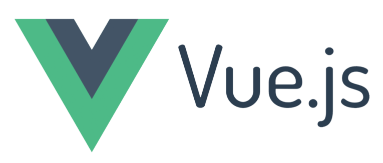

 

<h3 style="text-align:right; color: mediumseagreen">Learn Vue.js V3 with Codevolution</h3>

## What is Vue.js
- A popular JavaScript framework for building user interfaces
- The core Vue library is focused on doing one thing and doing that one thing really well which is building user interfaces
- Vue does not focus on the other aspects of your application like routing or HTTP requests
- Vue has a rich eco system of other powerful libraries that you can integrate
- VuesX npm package for complex state management, Vue router for routing, Vuetify for UI elements and a lot more

## Why Vue.js?
### 1. Vue is approachable
- Familiarity with HTML, CSS and JavaScript
- Add a script tag with a reference to vue.js and start building - Vue applications
- Vue Devtools which gives insight into your apps
- Vue CLI with which you can quickly scffold and manage projects
- Vue also has a component based architecture
- Vue is declarative
- Vue will make it painless for you to create complex user - interfaces by abstracting away the difficult parts

### 2.Vue is versatile
- Create powerful single page applications from scratch using build tools like webpack
- Incorporate Vue into your existing legacy projects and make progressive enhancement

### 3.Vue is performant
- Vue measures just 20KB minified and gzipped at runtime
- Better performance because of virtual DOM

> Vue is a framework built by taking the good parts from a lot of other libraries and frameworks and then improving where necessary

> Vue is going to be a great addition to your skillset